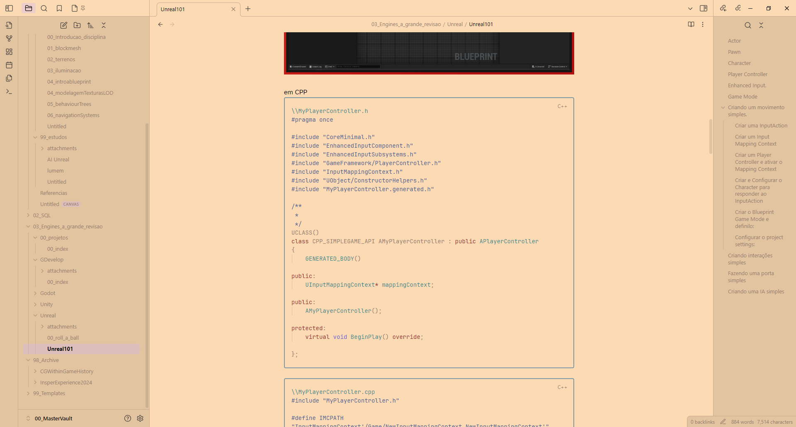

# Obsidian Peachpuff

## WIP

Vim's Peachpuff adapted to Obsidian.
Roughtly Based on https://github.com/vim/vim/blob/master/runtime/colors/peachpuff.vim 

## Installation

Add peachpuff.css in your snippets folder.
